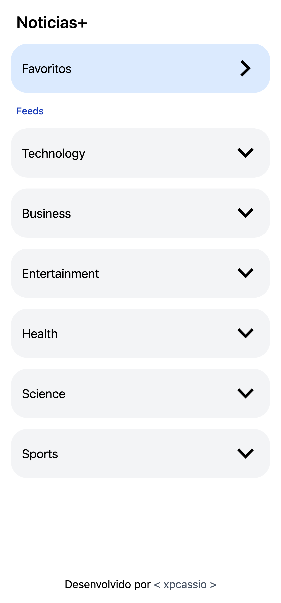
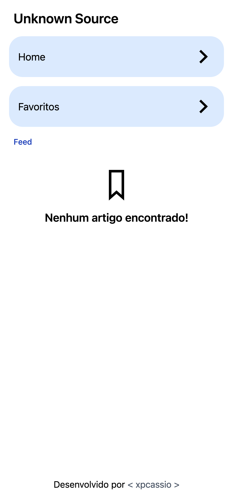
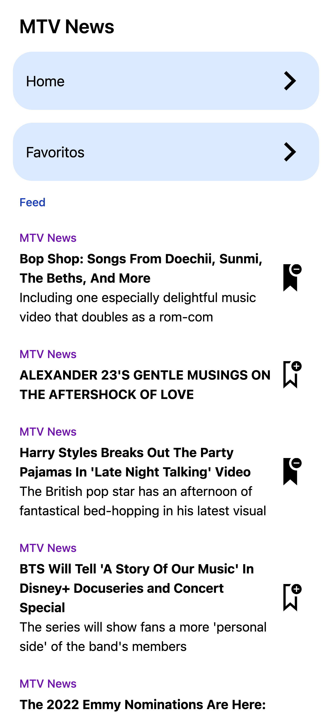
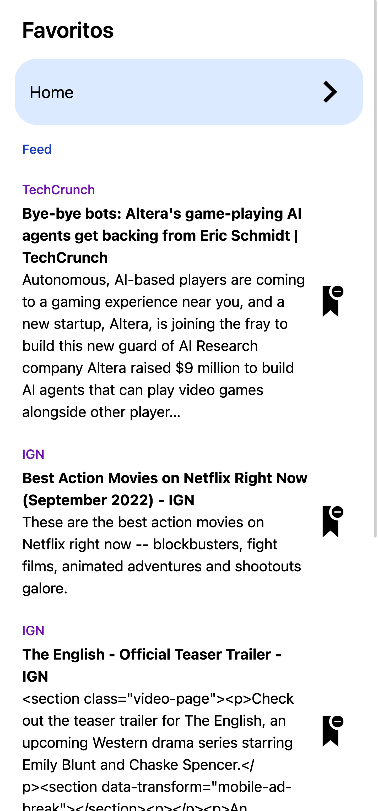
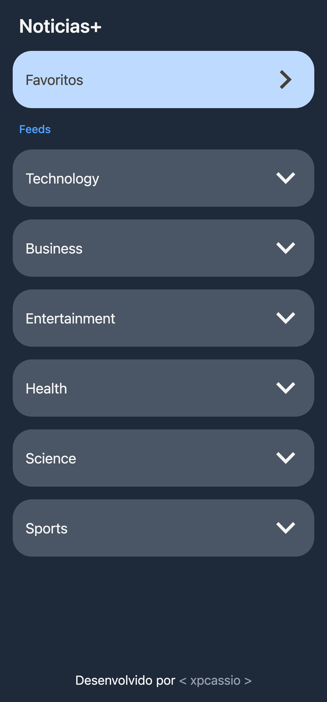
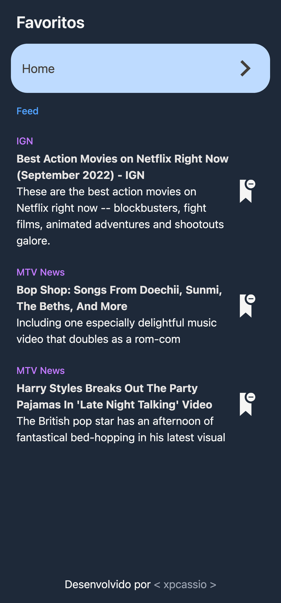

# NOTICIAS PLUS

Pequeno aplicativo de notícias que permite aos usuários listar e salvar suas notícias favoritas no localStorage. Feito em apenas 1 dia (algo em torno de 8h total).

## O Que foi utilizado

- [Vite](https://vitejs.dev/)
  For build and local development.

- [TailwindCSS](https://tailwindcss.com/)
  A utility-first CSS framework.

- [Prettier](https://prettier.io/)
  An opinionated code formatter on save.

- [Axios](https://axios-http.com)
  Promise based HTTP client for the browser and node.js.

- [SVGr](https://github.com/pd4d10/vite-plugin-svgr)
  Vite plugin to transform SVGs into React components.

## Configuração inicial

1. Rode `npm install`.

2. Crie uma conta em [newsapi](https://newsapi.org).

   - Não esqueça de copiar a API key que vai ser gerada.

3. Configure o arquivo .env.local com a API key.
   - Nele se encontram as variáveis para acessar a API de notícias. Para ver os tratamentos de erros, basta deixar em branco ou colocar algo errado.

## Decisões técnicas principais

- Fazer o maximo possivel em apenas 1 dia.
- Mentalidade MVP (Minimum Viable Product) focado em funcionalidades.
- Orientado ao frontend.
- Implementar dark mode.
- Implementar pwa.

## O que faria com mais tempo

- Substituiria o vite pelo nextjs.
- Salvaria em localStorage as preferencias visuais do usuário.
- Adicionaria filtros em todas as páginas em vez de uma busca simples apenas na listagem de noticias.
- Adicionaria teste.

## Imagens do Projeto

_Tela inicial_

_Tela noticias caso não existam artigos_

_Tela noticias com artigos_

_Tela favoritos_

_Tela favoritos com artigos salvos_

_Tela inicial em dark mode_

_Tela favoritos em dark mode_
